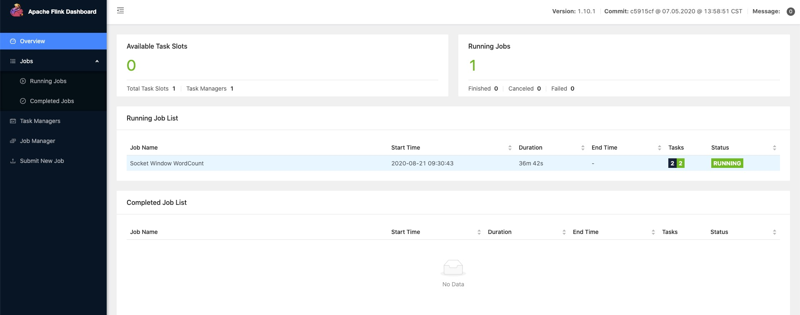

# Flink 安装
-----

### 1、下载Flink安装包

https://flink.apache.org/downloads.html

笔者下载的版本是：flink-1.10.1-bin-scala_2.11.tgz

然后解压缩


### 2、启动本地集群

```
./bin/start-cluster.sh
```

在浏览器中输入 http://localhost:8081 查看flink web页面




检查logs目录中的日志文件来验证系统是否正在运行：

cd /Users/onlyone/software/flink/flink-1.10.1/log

```
$ tail log/flink-*-standalonesession-*.log
INFO ... - Rest endpoint listening at localhost:8081
INFO ... - http://localhost:8081 was granted leadership ...
INFO ... - Web frontend listening at http://localhost:8081.
INFO ... - Starting RPC endpoint for StandaloneResourceManager at akka://flink/user/resourcemanager .
INFO ... - Starting RPC endpoint for StandaloneDispatcher at akka://flink/user/dispatcher .
INFO ... - ResourceManager akka.tcp://flink@localhost:6123/user/resourcemanager was granted leadership ...
INFO ... - Starting the SlotManager.
INFO ... - Dispatcher akka.tcp://flink@localhost:6123/user/dispatcher was granted leadership ...
INFO ... - Recovering all persisted jobs.
INFO ... - Registering TaskManager ... under ... at the SlotManager.
```

### 3、运行官方示例

首先，使用netcat来启动本地服务器

```
## 服务端，绑定端口等待连接
nc -l 9100
```

运行flink 官方demo示例，位于安装包的example目录下

```
./bin/flink run examples/streaming/SocketWindowWordCount.jar --port 9100
```


nc（输入在点击后逐行发送到Flink）：

```
nc -l 9100

ab
ab
a b
a b
a b
```

单词在5秒的时间窗口（处理时间，翻滚窗口）中计算并打印到stdout。监视TaskManager的输出文件并写入一些文本

查看打印的日志数据：

```
$ tail -f log/flink-*-taskexecutor-*.out

ab : 2
a : 3
b : 3
```

### 4、停止Flink

```
./bin/stop-cluster.sh
```

### 5、参考

https://blog.csdn.net/Android_xue/article/details/91819641